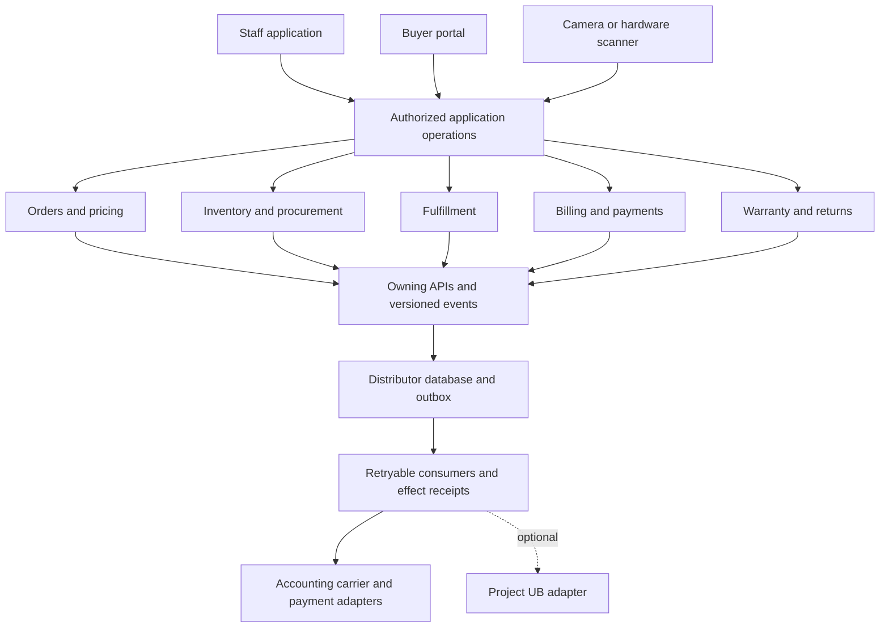

# Proposed modular architecture

Status: proposed target architecture with partial local implementation. The actual coverage and remaining acceptance work are tracked in [implementation status](IMPLEMENTATION.md); business choices are tracked in [decisions](DECISIONS.md). No product gate is inferred passed.

The [domain/command contracts](CONTRACTS.md) expand this design into proposed records, state transitions and task-shaped operations. [Requirements](REQUIREMENTS.md) maps every delivery task to its acceptance signal; [discovery](DISCOVERY.md) contains the business-rule inputs and illustrative reconciliation oracle. None of these proposals is an approved schema or implemented interface.

## Product shape

Start with one application composition, one product database and a background worker. A staff interface, buyer portal and mobile scanning interface share owning application operations. Proposed implementation language is TypeScript if OPUS reuse is selected; exact frameworks, versions, database schema and queue product are chosen in D-003/D-007. A whole-platform adoption changes this choice and needs a revised boundary map.

## Ownership

| Module | Owns | Public operations or events |
| --- | --- | --- |
| Identity/accounts | Staff/buyer identity, customer accounts, roles and warehouse grants | Authorize operation; resolve authorized account context |
| Catalog/pricing | Product/UOM definitions, barcode aliases, price policies | Quote order lines; resolve scanned product identifier |
| Procurement | Suppliers, purchase orders and commercial receipt expectations | Approve PO; reconcile supplier receipt |
| Inventory | Stock positions, movements, serials/lots, reservations, costs and transfers | Receive, reserve, release, consume, transfer, inspect, adjust |
| Orders | Cart, sales order, accepted price/tax/terms evidence and backorders | Accept, hold, cancel, amend, request fulfillment |
| Fulfillment | Picks, packs, shipment lines, tracking and collection evidence | Confirm picks; commit shipment; reconcile uncertain carrier result |
| Billing | Invoice/credit documents, receivables, payment/refund state and reconciliation | Invoice accepted commercial evidence; credit; record verified payment |
| Warranty/returns | Coverage and claims, RMA decisions and disposition orchestration | Register sold coverage; authorize return; request inventory disposition/credit |
| Integration | External IDs, credentials references, adapter checkpoints and delivery receipts | Export/import approved records through owning operations |
| Migration | Versioned source evidence, immutable dry-run reviews, rejected rows and permanent source mappings | Preview opening stock; review/apply through inventory-owned custody operations |
| Platform | Audit, documents, notifications, outbox/inbox, module composition | Scoped infrastructure primitives, not business table proxies |

Procurement and scanning can be submodules initially. Ownership matters more than the number of folders. Shared database access does not grant permission to alter another module's records. Read models are explicitly owned projections or authorized interfaces, not unrestricted foreign joins. No service-job identity is fabricated to represent an order or shipment.

## Extension contract

A later module declares its ID/version, compatible core version, dependencies, permissions, routes, contracts, event subscriptions, migrations, worker registrations and support owner. Prefer compile-time registration and deployment through the normal release process. Runtime execution of untrusted third-party plugins is outside scope.

Modules call task-shaped interfaces such as `reserveForOrder`, not generic foreign-table CRUD. Inventory alone determines whether stock can be allocated. A module's migrations alter only its owned schema; cross-module reference changes need a versioned agreement. The core contains no imports back into optional module internals.

G1 proof adds an optional notification/report projection module, enables and disables it, and verifies order/inventory/billing contract tests remain unchanged and pass. A test deliberately attempting foreign persistence must fail. The acceptance claim is extension without rewriting core business logic, not zero configuration or perpetual compatibility.

## Stock and scanning rules

Stock position key includes product, warehouse/bin, condition and relevant lot/serial identity. Track physical on-hand, reserved, available, quarantine and in-transit explicitly. Reserving changes availability, not physical on-hand. Transfers remove usable source stock, retain in-transit evidence and make destination stock usable only at confirmed receipt. Movement and valuation evidence reconcile; approved adjustments are auditable.

Use exact quantities/UOM conversions and currency arithmetic. Whole-unit assumptions cannot become implicit decimal rounding. A serial has one authorized physical/custody state; duplicate labels, identifier scopes, reused manufacturer serials and replacements follow G0 rules.

A scan decodes an identifier; it does not independently grant permission or create stock. SKU/GTIN identifies a product; serial identifies a unit; location/pallet labels identify other entities. Select the operation and warehouse, resolve identifiers, validate expected product/quantity/serial and then commit through the owning command with an idempotency key. Unknown identifiers open controlled registration/rejection, never silently create equipment.

Phone camera and keyboard-style hardware scanners use the same workflow. Verify input focus, suffixes, repeated scans, damaged labels, wrong items/warehouses, camera denial, printed-label readability and manual fallback on actual selected hardware. Images/OCR can assist entry later but must not invent a serial or stock receipt.

Default offline behavior: clearly show stale lookup data and hold non-authoritative drafts; allocation/shipment requires server confirmation. If authoritative offline transactions are selected, separately design conflict resolution, local credential/storage protection, reconciliation and physical-stock authority, then re-estimate. Installing a web app does not establish offline correctness.

## Transactions, events and adapters

Critical invariants commit inside the owning database transaction. Where a coordinated operation must be atomic, a controlled application transaction invokes owning interfaces; it is not an exception allowing foreign writes. Longer workflows persist explicit states and compensate/reconcile failures rather than pretending an external API call is database-atomic.

Commit required publication intent with business state. Use at-least-once delivery, deduplicated inboxes and durable effect receipts. Envelope includes event ID, version, organization, source/aggregate ID and revision, occurred/recorded times and correlation/causation. Never let old messages overwrite newer state. A successful publish/ACK is not proof of a carrier booking, accounting posting or settled payment. Unknown external outcomes require lookup/reconciliation before retrying an effect.

A new contract version includes old/new fixtures and compatibility policy. Unsupported versions quarantine with actionable reason. Retries, expired leases, recovery and replay must preserve stock/money results. Reporting may be eventually consistent; authoritative allocation and billing cannot rely on an arbitrarily stale projection.

## Project UB

UB is useful for external-source identities, reviewed mappings, provenance, context views and replay. Its inventory/financial reference projections do not become our stock or receivables ledger. Proposals enter through authorized owning operations; no direct UB writes to product tables.

Keep UB behind one optional adapter. Native application startup, sales, picking, invoices and returns remain functional when it is disabled or unavailable. Existing provider adapters retain routing ownership until a verified cutover; never create two writers for the same effect. UB adoption begins with read-only/synthetic contract qualification in D-042–D-044. Production connectivity is not part of the current UB evidence or this authorization.

Revisit separate services, stronger broker topology and reusable cross-product packages only when measured deployment/scale/team needs justify their added costs.
